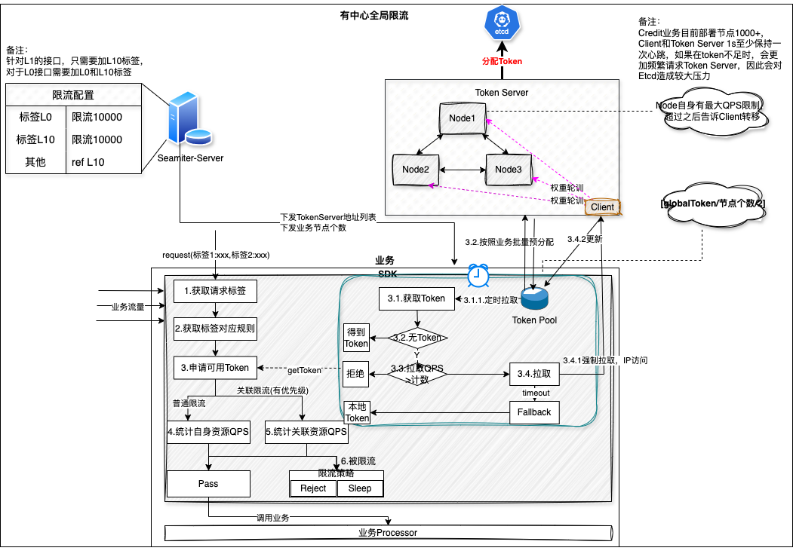
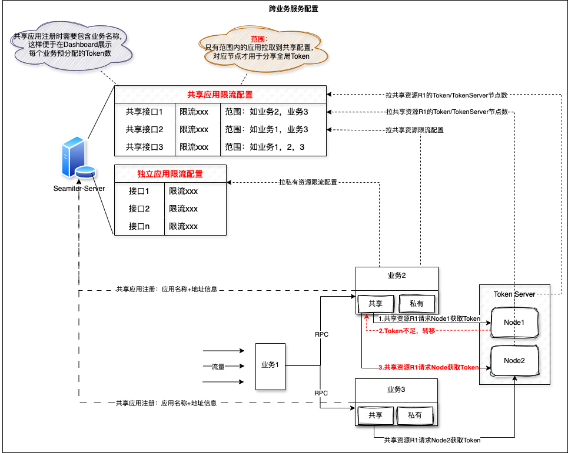
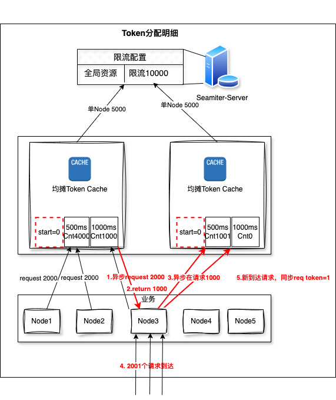

## 1、整体思路

<div align="center">图1：无中心全局限流</div>

对于全局限流的整体流程包含：流量打标、限流规则配置、Token Server分配限流、具体流量处理；同时在全局限流时TokenServer自身怎么处理、TokenClient怎么和TokenServer交互；

以下是按照这个流程进行讲解的。

### 全局流程
#### 1.1 流量打标
（1）首先业务按照重要性对接口进行等级划分，如L0、L1、L2级别接口，其重要性L0>L1>L2

（2）业务在入口处，如gateway对流量进行打标，对于L0级别接口需要打两个标：L0,L10；对于L1级别接口只需要打一个标L10

#### 1.2 限流规则配置
（1）在seamiter热点限流中配置资源级别接口

（2）配置对应的热点标签，如metadata中的flag=L0的阈值，flag=L10时的阈值

（3）配置关联限流，在metadata的flag不为L0,L10使关联到标签为L0的限流阈值。此处要表达的意思是当标签不为L10时，只要L10的Qps达到阈值就限制标签非L10的流量。

#### 1.3 Token Server分配限流
（1）TokenServer启动后，均摊针对全局限流的阈值，并把阈值维护在本地node中。同时自身维护一个滑动窗口，用于统计客户端申请的Token。

#### 1.4 流量处理
（1）sdk拦截请求流量，并取出metadata中的标签

（2）通过资源接口及标签获取对应的配置阈值

（3）申请处理此次请求的Token

（4）如果是普通限流，如标签为L0,L10，如果Token>0则通过；如果Token<=0则拒绝或者Sleep

（5）如果限流为关联限流，申请Token为被关联接口的Token数，如果Token>0则通过；如果Token<=0则拒绝或者Sleep。（备注：此处是根据关联接口判断自身是否可以通过）

（6）如果申请Token超时，退化为本地限流

### 全局限流
#### 1.5 Client
（1）Client会在业务启动时从Dashboard获取到全部的Token Server地址及服务节点数

（2）Client计算批量获取的Token数，暂定为max(【全局阈值/节点个数/2】,1)，并向上取整。对于小流量问题，向上取整会稍微放大阈值。

（3）Client每秒获取一次Token，更新本地Token

（4）当调用getToken时，如果本地Token没有值，则立刻向TokenServer发起一次请求获取Token，并更新本地Token。

（5）如果向TokenServer请求失败超时或者TokenServer回复要转移，则请求下一个Client，并降低其优先级。

（6）如果请求的其中一台返回没有Token，则继续调用下一个TokenServer，如果下一个也返回没有Token，则继续下一个；如果半数返回没有Token，则说明Token已经耗尽。

#### 1.6 TokenServer
（1）TokenServer启动时，向Seamiter-Server进行注册

（2）Seamiter-Server把均摊后的Token下发给全部的Token Server节点

（3）Token Server自身维护被请求的QPS，如10W，如果超过阈值，则通知Clien进行转移

### 有中心全局限流


<center>图2:有中心分布式限流算法</center>
此种思路整体上和【无中心分布式限流算法】一致，只是增加了中心节点进行管理分布式限流。
我们假设通过Etcd实现分布式限流。

如果通过Etcd实现分布式限流，那么一般通过【Etcd锁+原子加减】来实现。
```cgo
// 尝试获取分布式锁
err := mutex.Lock(context.Background())
if err != nil {
log.Println(err)
return
}
defer mutex.Unlock(context.Background())

// 增加限流器计数器
err = limiter.Increment()
if err != nil {
log.Println(err)
return
}

// 执行业务逻辑
// 这里可以放置需要限流的代码


// 减少限流器计数器
err = limiter.Decrement()
if err != nil {
log.Println(err)
return
}
```

同时需要增加一个定时器用于更新计数的有效期。

总结下来区别如下：

无中心节点时：

当Client端缓存的Token不足时，需要遍历Token Server请求额外需要的Token，以便达到全局限流的效果

有中心节点时：

如果每个请求都请求到TokenServer，则TokenServer的请求量和业务的请求量保持一致，需要更多的资源；

如果通过缓存Token到本地，则在本地Token不足时，需要TokenServer的一个节点请求Etcd中心节点，不需要便利每一个Token Server节点。

弊端如下：

（1）有中心：依赖Etcd，如果Etcd出现非预期问题，会导致限流失败

（2）不精准：使用定时器只能实现【固定时长】的限流算法

（3）对Etcd压力大：一次加/解锁需要对Etcd至少4次操作，即便通过分批操作，也会对Etcd Server造成比较大的压力。Etcd作为服务注册发现的核心组件，一旦出现性能问题，将会对整个业务造成影响。

## 2、跨业务处理过程


<center>图3:跨业务处理流程</center><br/>

为了处理跨业务的全局限流，我们抽象出【共享应用限流配置】【独立应用限流配置】，对于目前业务的使用都是为【独立应用限流配置】。

对于业务来说，如果希望使用两种限流配置，需要开启【共享应用限流配置】的开关，此开关开启后，业务节点会同时加载【共享应用限流配置】【独立应用限流配置】配置。

当业务流量到达时，如果是【共享应用限流配置】，则通过Token Server中心，整体控制Token的使用情况。

【共享应用限流配置】中的每一个限流接口都需要标记作用范围，这样在seamiter-server计算批量拉取的Token数时，只有作用范围内的节点才会被作为真实需要Token的节点，避免无用节点预分配Token.

## 3、Token分配


<center>图4:Token分配</center><br/>

对于一个全局资源，Token Server会均摊Seamiter Server的全局配置。

业务节点在启动时，会根据节点数定时从Token Server加载一定数量的Token数。

如果某个节点加载Token时，没办法从一个节点加载到需要的Token数，则会需要请求另外一个节点获取Token。

如果单位时间内的请求数大于Node缓存的Token数，则会发生同步RPC请求，一次只请求当前Request需要的Token数。备注：此过程如果持续Token数不足，则会发生多次同步RPC请求。

